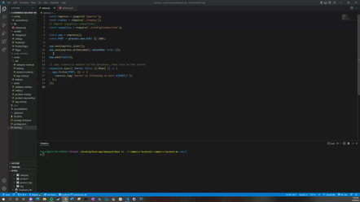
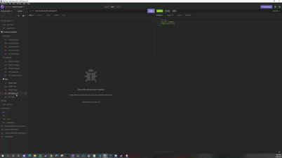

# Miggy's E-Commerce Backend
## Description
  
This program was created by mae2136. If you have any questions on how this program works, please reach out to me at mae2136@gmail.com.

This project contains the backend database and routes for an e-commerce backend. It can be customized to your company's needs. This program uses mySQL for the database and sequelize to create the models.
  
## Table of Contents
  
- [Description] (#description)
- [Installation] (#installation)
- [Usage] (#usage)
- [Credits] (#credits)
- [Contributing] (#contributing)
- [License] (#license)
  
## Installation
  
Installation Instructions: npm i
  
## Usage
This repository can be viewed at the following link: [Github Repo](https://github.com/mae2136/e-commerce-backend-me)
  
How to use the program:
```
To try it out, install the dependencies in node.js/the terminal. Run the mySQL database and seed the database using npm run seed.
```


```
Then, start the server in the terminal using node server.js or nodemon server.js

You can use a program like Insomnia to check the routes. Below are tests for each route
```
All GET Routes


POST & PUT Routes


DELETE Routes



## Contributing
  
You can fork my program from my github and customize it to your preferences.
  
## Tests
  
You can test all the routes using Insomnia.

## Credits
  
I would like to credit my wife and the Northwestern University bootcamp I attend.

## License
  
MIT License

Copyright (c) 2022 Miguel Escobar

Permission is hereby granted, free of charge, to any person obtaining a copy
of this software and associated documentation files (the "Software"), to deal
in the Software without restriction, including without limitation the rights
to use, copy, modify, merge, publish, distribute, sublicense, and/or sell
copies of the Software, and to permit persons to whom the Software is
furnished to do so, subject to the following conditions:

The above copyright notice and this permission notice shall be included in all
copies or substantial portions of the Software.

THE SOFTWARE IS PROVIDED "AS IS", WITHOUT WARRANTY OF ANY KIND, EXPRESS OR
IMPLIED, INCLUDING BUT NOT LIMITED TO THE WARRANTIES OF MERCHANTABILITY,
FITNESS FOR A PARTICULAR PURPOSE AND NONINFRINGEMENT. IN NO EVENT SHALL THE
AUTHORS OR COPYRIGHT HOLDERS BE LIABLE FOR ANY CLAIM, DAMAGES OR OTHER
LIABILITY, WHETHER IN AN ACTION OF CONTRACT, TORT OR OTHERWISE, ARISING FROM,
OUT OF OR IN CONNECTION WITH THE SOFTWARE OR THE USE OR OTHER DEALINGS IN THE
SOFTWARE.
